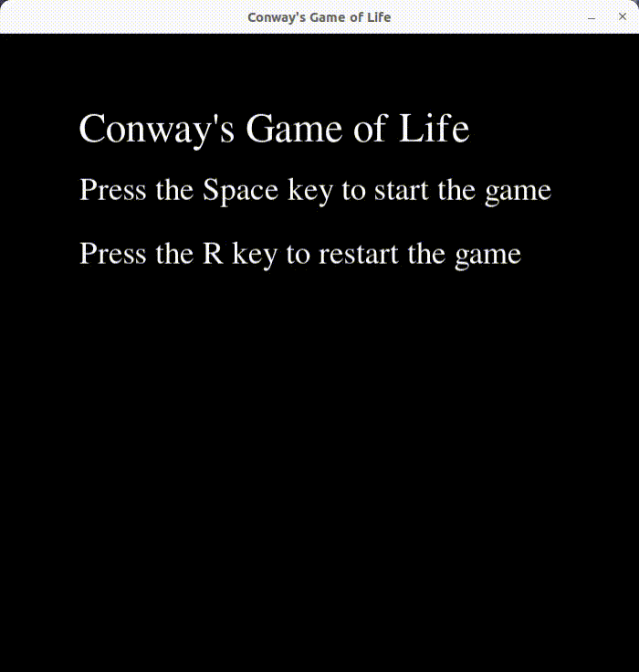

# Conway's Game of Life in Python
A python script for playing the Conway's Game of Life. More information concerning the game can be found [here](https://en.wikipedia.org/wiki/Conway%27s_Game_of_Life). A preview of the program is presented below.



## Installation

1. Clone the repository to local machine.
```
git clone https://github.com/JohnNellas/ConwaysGameOfLifePython.git
```
2. Move inside the cloned directory entitled ```ConwaysGameOfLifePython```.
```
cd ConwaysGameOfLifePython
```
3. Install the required modules from the ```requirements.txt``` file.
```
pip install -r requirements.txt
```
4. See the documentation of the main program ```main.py```.
```
python3 main.py --help

usage: main.py [-h] [--height HEIGHT] [--width WIDTH] [--resolution RESOLUTION] [--prob0 PROB0] [--updateSpeed UPDATESPEED]

A python script for the Conway's Game of Life.

optional arguments:
  -h, --help            show this help message and exit
  --height HEIGHT       The window height.
  --width WIDTH         The window width.
  --resolution RESOLUTION
                        The grid resolution.
  --prob0 PROB0         The probability of sampling a dead cell during game initialization
  --updateSpeed UPDATESPEED
                        The time it takes to refresh the frame.
```

### Example
Start the Conway's Game of Life on a 700x700 window with a grid resolution of 10. 
```
python3 main.py --width 700 --height 700 --resolution 10
```